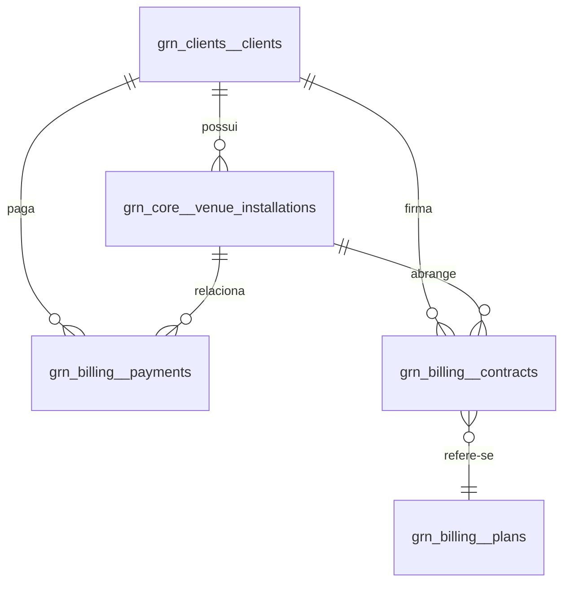

# README — Relacionamentos do Modelo de Dados (Grava Nóis)

Este documento descreve como as entidades **Clients**, **Venue Installations** e **Payments** (e extensões opcionais **Contracts** e **Plans**) se relacionam no backend do Grava Nóis, garantindo clareza operacional, cobrança e conformidade com LGPD.

---

## 0) Schemas (MVP)

Adotamos três schemas no PostgreSQL para isolar responsabilidades e facilitar permissões/backup:

* **grn\_clients** → tabela `clients` (PII, contatos, CNPJ/CPF, `payment_customer_id`).
* **grn\_core** → tabela `venue_installations` (operação, geolocalização, snapshot comercial).
* **grn\_billing** → tabela `payments` (e futuramente `contracts` e `plans`).

**Benefícios**: conformidade LGPD (PII isolada), separação de acessos (RW/RO por schema), migrações e restaurações granulares.

**Dica de conexão (search\_path)**:

```sql
SET search_path = grn_core, grn_clients, grn_billing, public;
```

**Permissões sugeridas**:

* App RO: `USAGE` no schema + `SELECT` nas tabelas.
* App RW: `USAGE` no schema + `SELECT, INSERT, UPDATE, DELETE`.

## 1) Visão Geral

* **Clients**: quem contrata (empresa ou pessoa). Mantém PII (CPF/CNPJ), contatos e referência ao cliente no provedor de pagamento.
* **Venue Installations**: cada implantação física do sistema (quadra/campo/ginasio). Contém metadados operacionais (câmeras, buffers, firmware), geolocalização e um snapshot comercial (método de contrato + status de pagamento atual).
* **Payments**: cada evento de cobrança (assinatura recorrente ou compra avulsa por vídeo). Armazena provedor, método, status, valores e metadados brutos de conciliação.
* **Contracts** (opcional, recomendado): vínculo entre client/installation e um **Plan**, com datas e ciclo de faturamento.
* **Plans** (opcional): catálogo de planos (mensal, por franquia de vídeos, etc.).

---

## 2) Diagrama ER (alto nível)



**Chaves e FKs principais**

* `grn_core.venue_installations.client_id -> grn_clients.clients.id`
* `grn_billing.payments.client_id -> grn_clients.clients.id`
* `grn_billing.payments.installation_id -> grn_core.venue_installations.id` (opcional)
* `grn_billing.contracts.client_id -> grn_clients.clients.id`
* `grn_billing.contracts.installation_id -> grn_core.venue_installations.id`
* `grn_billing.contracts.plan_id -> grn_billing.plans.id`

---

## 3) Entidades (resumo de campos-chave)

### 3.1 Clients *(schema: `grn_clients.clients`)*

* **Identificação**: `id (uuid)`, `legal_name`, `trade_name?`
* **PII**: `cnpj?`, `responsible_cpf?`, `responsible_name?`, `email?`, `phone?`
* **Gateway**: `payment_customer_id?`
* **Auditoria**: `created_at`, `updated_at`, `deleted_at?`

> **LGPD**: dados sensíveis devem ser criptografados em repouso e mascarados em UI/logs.

### 3.2 Venue Installations *(schema: `grn_core.venue_installations`)*

* **Relacionamento**: `client_id (FK -> clients.id)`
* **Identidade**: `venue_name`, `description?`, `sport_type?`
* **Localização**: `country_code?`, `state?`, `city?`, `district?`, `address_line?`, `postal_code?`, `latitude?`, `longitude?`, `timezone?`
* **Operação**: `camera_count`, `firmware_version?`, `upload_endpoint?`, `buffer_pre_seconds`, `buffer_post_seconds`, `is_online`, `last_heartbeat_at?`, `network_type?`, `network_note?`
* **Comercial (snapshot)**: `contract_method (per_video|monthly_subscription)`, `payment_status (none|active|past_due|canceled)`, `contract_id?`
* **Status de ciclo de vida**: `installation_status (active|paused|decommissioned)`, `active (bool)`
* **Auditoria**: `created_at`, `updated_at`, `deleted_at?`

> **Por que snapshot comercial aqui?** Para filtros rápidos em dashboards. O detalhe completo fica em `contracts`/`payments`.

### 3.3 Payments *(schema: `grn_billing.payments`)*

* **Relacionamentos**: `client_id (FK)`, `installation_id (FK, opcional)`
* **Provedor**: `provider (stripe|mercado_pago|manual)`, `method? (credit_card|pix|boleto|cash)`
* **Status**: `status (pending|paid|failed|refunded|partially_refunded|canceled)`
* **IDs do provedor**: `provider_payment_id?`, `provider_customer_id?`
* **Valores**: `amount numeric(10,2)`, `currency 'BRL'`, `fee_amount numeric(10,2)`
* **Datas**: `paid_at?`, `due_at?`
* **Metadados**: `description?`, `metadata jsonb?`
* **Auditoria**: `created_at`, `updated_at`, `deleted_at?`

### 3.4 Contracts (opcional, recomendado) *(schema: `grn_billing.contracts`)*

* **Relacionamentos**: `client_id (FK)`, `installation_id (FK)`, `plan_id (FK)`
* **Ciclo**: `start_at`, `end_at?`, `renewal (bool)`, `cancel_reason?`
* **Faturamento**: `billing_cycle (mensal, anual, etc.)`
* **Status**: `active (bool)`

### 3.5 Plans (opcional) *(schema: `grn_billing.plans`)*

* **Catálogo**: `name`, `code`, `price`, `currency`, `periodicity`, `limits (ex.: vídeos/mês)`

---

## 4) Fluxos Típicos

### 4.1 Onboarding de Cliente e Instalação

1. Criar **Client** com PII e `payment_customer_id` do gateway (opcional).
2. Criar **Venue Installation** vinculada ao `client_id` com geo/operacional.
3. (Opcional) Criar **Contract** associando Plan e datas de ciclo.
4. Provisionar agente (Raspberry Pi) com `installation_id`, `upload_endpoint` e chaves.

### 4.2 Compra **por Vídeo (pay-per-video)**

1. Usuário final compra um clipe → gateway cria **Payment** (`status = pending`).
2. Webhook do gateway confirma pagamento → atualizar **Payment.status = paid**, `paid_at`.
3. Atualizar snapshot em **Venue Installation** (`payment_status = none` permanece, pois não é assinatura) e liberar download.

### 4.3 **Assinatura Mensal**

1. **Contract** ativo com Plan mensal.
2. A cada ciclo, gateway cria e liquida **Payment** (`status = paid`).
3. Snapshot em **Venue Installation** → `payment_status = active` enquanto não houver inadimplência.
4. Se falhar a renovação → `payment_status = past_due` e, após carência, `canceled`.

---

## 5) Regras de Integridade e Índices

* Índices úteis:

  * `venue_installations(client_id, city)`
  * `payments(client_id, installation_id, status)`
  * (Opcional PostGIS) índice GiST para `GEOGRAPHY(Point,4326)` se usar tipo geográfico
* Restrição parcial para evitar duplicidade de nome de instalação por cliente:

  * **Unique parcial**: `(client_id, venue_name) WHERE deleted_at IS NULL`
* `payments.amount` e `fee_amount` como `numeric(10,2)` (precisão de moeda); tratar como string na app para não perder precisão.

---

## 6) Segurança & LGPD

* **PII (CPF/CNPJ)** no **Clients**; evite duplicar na instalação. Se cachear, criptografe campos e mascare na UI.
* **Criptografia em repouso** (KMS/app-layer) e controle de acesso por função.
* **Auditoria** de quem leu/alterou dados sensíveis.

---

## 7) Webhooks e Conciliação

* Persistir **payload completo** do provedor em `payments.metadata (jsonb)` para auditoria e reprocessos.
* Idempotência: ao processar webhook, use `provider_payment_id` com chave única lógica.
* Em caso de `refund`/`chargeback`, atualizar `payments.status` e registrar `amount` reembolsado.

---

## 8) Exemplos de Consultas SQL

**8.1 Últimos pagamentos de uma instalação**

```sql
SELECT p.*
FROM grn_billing.payments p
WHERE p.installation_id = $1
ORDER BY p.created_at DESC
LIMIT 20;
```

**8.2 Instalações ativas e adimplentes por cliente**

```sql
SELECT vi.*
FROM grn_core.venue_installations vi
WHERE vi.client_id = $1
  AND vi.installation_status = 'active'
  AND (vi.contract_method = 'per_video' OR vi.payment_status = 'active');
```

**8.3 Faturamento por mês (BRL)**

```sql
SELECT date_trunc('month', paid_at) AS mes,
       SUM(amount::numeric) AS total_brl
FROM grn_billing.payments
WHERE status = 'paid' AND currency = 'BRL'
GROUP BY 1
ORDER BY 1 DESC;
```

---

## 9) Boas Práticas de Backend

* **Idempotência** em criação/atualização de `payments` (chaves naturais do provedor).
* **Transações** ao atualizar `payments` + snapshots em `venue_installations`.
* **Retries** e DLQ para webhooks.
* **Observabilidade**: métricas por instalação (heartbeats, latência de upload, erros de pagamento).

---

## 10) Roadmap de Evolução

* Migrar lat/long para **PostGIS**.
* Normalizar `sport_type` com tabela auxiliar.
* Implementar **Contracts** e **Plans** para billing limpo.
* Vincular `payments` a **invoices** (faturas) se houver emissão fiscal.
* Criar **tabela de heartbeats** para histórico e SLOs de disponibilidade.

---

**Contato técnico**: mantenedores do backend Grava Nóis.
